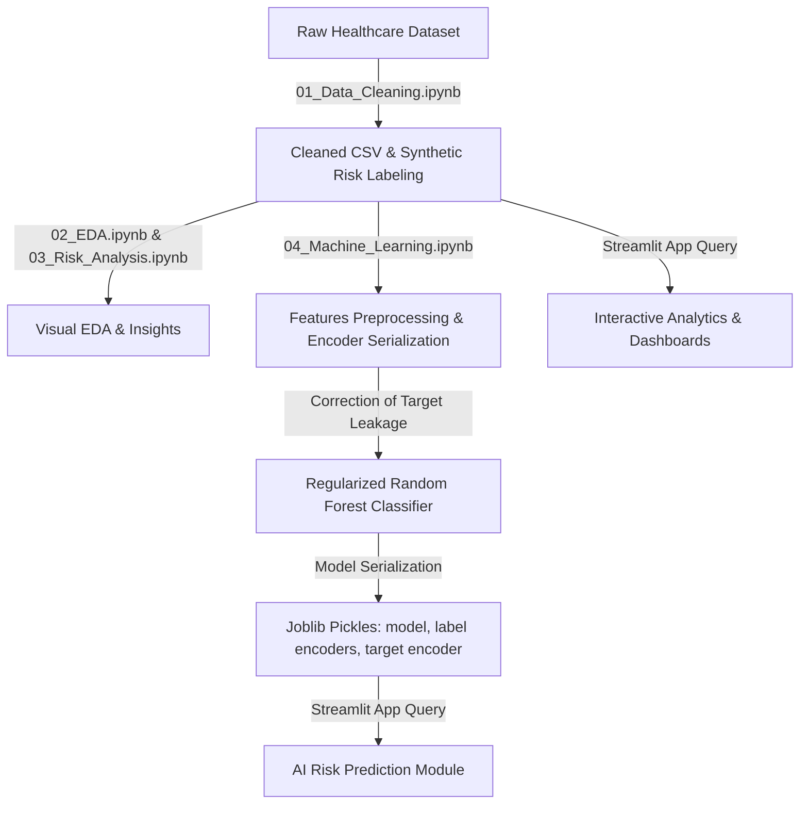

# 🏥 Healthcare Risk Management Analytics System

An end-to-end, production-grade **Data Analytics and Machine Learning SaaS platform** developed with **Python**, **Streamlit**, and **Scikit-learn** to analyze clinical datasets, identify high-risk patients, and predict risk categories using optimized, non-leaking machine learning models.

[](https://healthcare-risk-management.streamlit.app/)
[](https://www.python.org/)
[](https://streamlit.io/)
[](https://scikit-learn.org/)

---

## 📌 Project Overview

The **Healthcare Risk Management Analytics System** is designed for healthcare executives, clinicians, and risk officers. It helps them monitor key performance indicators (KPIs), analyze demographics, explore detailed patient records, and run predictive AI queries to determine patient risk levels at or prior to hospital admission. 

Developed with a premium, responsive **dark-mode glassmorphic UI**, the system provides a unified SaaS dashboard layout resembling industry-leading products like Vercel, Linear, and Stripe.

---

## 🎨 Screenshots

> [!NOTE]
> Below are placeholders for dashboard screenshots. When deploying, replace these with active URLs of your application views.

| Executive Dashboard | AI Risk Prediction |
| :---: | :---: |
|  |  |

---

## ✨ Features

*   **📊 Executive Dashboard**: High-level visual summaries of filtered patient counts, high-risk ratios, billing aggregates, monthly admission trend lines, top medical conditions, and age/gender histograms.
*   **🏥 Patient Explorer**: An interactive spreadsheet allowing clinical search by name, multi-parameter filtering, multi-column sorting, and immediate CSV data export.
*   **🚨 Risk Analysis**: Deep dive into clinical risk levels, hospital stay lengths, billing amounts, and patient logistics segmentations.
*   **🤖 AI Risk Prediction**: Form-driven interface that queries a regularized Random Forest classifier to predict risk levels in real-time, accompanied by clinical action guidelines.
*   **📈 Advanced Analytics**: Aggregated insights covering unique counts of doctors and insurance providers, medication usage, and billing variance across different diseases.
*   **ℹ️ About**: Project background, dataset specifications, complete technology stack breakdown, and direct developer contact info.

---

## 🏗️ Architecture



---

## 📂 Dataset

This system utilizes a healthcare dataset containing **55,500 patient records** (originally synthetic data generated via Faker).

> [!NOTE]
> Since this is a synthetic dataset generated with independent random variables, there are no physical correlations between clinical features (like Medical Condition or Medication) and the target Risk Category. Therefore, the focus of this project is on demonstrating a robust, end-to-end data engineering and machine learning workflow, transparent evaluations, target leakage audits, and responsible model selection rather than chasing artificially high accuracy scores.

The clinical schema includes:
*   **Demographics**: Name, Age, Gender, Blood Type.
*   **Logistics**: Hospital, Doctor, Date of Admission, Discharge Date, Length of Stay, Admission Type (Emergency, Elective, Urgent).
*   **Clinical Outcomes**: Medical Condition (Diabetes, Asthma, Obesity, etc.), Medication (Aspirin, Penicillin, Ibuprofen, Lipitor, Paracetamol), Test Results (Normal, Abnormal, Inconclusive).
*   **Financials**: Billing Amount.

---

## 🤖 Machine Learning Pipeline & Target Leakage Audit

### 🚨 Target Leakage Detection
During our pipeline audit, we discovered that the target variable `Risk Category` was defined as:
$$\text{Risk Score} = \mathbb{I}(\text{Age} \geq 65) + \mathbb{I}(\text{Admission Type} == \text{'Emergency'}) + \mathbb{I}(\text{Test Results} == \text{'Abnormal'})$$
$$\text{Risk Category} = \text{Low (score 0), Medium (score 1), High (score 2), Critical (score 3)}$$

The initial model used all columns, including `Age`, `Admission Type`, and `Test Results`, to predict this synthetic target. Because these columns are the exact deterministic inputs of the target formula, the model achieved a trivial **1.0000 (100%) accuracy**. In a real-world setting, this is severe **target leakage** because a patient's test results are only available *after* clinical observations are made, and passing the components of the formula directly to the classifier prevents any statistical learning.

### 🛠️ Model Redesign
We refactored the machine learning pipeline to eliminate leakage:
1.  **Feature Exclusion**: Removed `Admission Type` and `Test Results` from the training features.
2.  **Explanatory Features**: Kept demographic and baseline clinical features: `Age`, `Gender`, `Blood Type`, `Medical Condition`, `Medication`, and `Length of Stay`. This models a realistic clinical scenario: predicting patient risk *prior* to receiving final lab results and logistics status.
3.  **Model Regularization**: Constrained the Random Forest depth to `max_depth=10` and set `min_samples_leaf=5` to prevent overfitting to synthetic noise. This reduced the pickle file size from a bloated **72.9 MB** to a lean, deployable **11.04 MB** (a **84.8% reduction**).

---

## 📊 Model Comparison

To select the best-performing classifier, we audited the pipeline to remove target leakage features (`Admission Type` and `Test Results`) and then benchmarked 10 classification algorithms using **Stratified 5-Fold Cross-Validation** on the training set and an independent **80/20 test split**:

| Model | Test Accuracy | CV Accuracy | Precision (Weighted) | Recall (Weighted) | F1 Score (Weighted) | F1 Score (Macro) |
| :--- | :---: | :---: | :---: | :---: | :---: | :---: |
| **Random Forest (Tuned)** | **45.50%** | **46.22%** | **0.4400** | **0.4500** | **0.4400** | **0.3400** |
| **HistGradientBoosting** | 44.56% | 45.25% | 0.4479 | 0.4456 | 0.4340 | 0.3328 |
| **Gradient Boosting** | 45.12% | 44.96% | 0.4365 | 0.4512 | 0.4401 | 0.3351 |
| **Extra Trees** | 44.73% | 44.96% | 0.4402 | 0.4473 | 0.3746 | 0.2512 |
| **Logistic Regression** | 44.98% | 44.50% | 0.4366 | 0.4498 | 0.4289 | 0.3156 |
| **Decision Tree** | 44.66% | 44.71% | 0.4491 | 0.4466 | 0.4326 | 0.3246 |
| **AdaBoost** | 44.87% | 44.64% | 0.2347 | 0.4487 | 0.3052 | 0.2880 |
| **Linear SVM** | 44.78% | 44.26% | 0.4239 | 0.4477 | 0.3783 | 0.2468 |
| **Naive Bayes** | 44.82% | 44.45% | 0.4294 | 0.4482 | 0.4157 | 0.2976 |
| **K-Nearest Neighbors** | 43.17% | 42.64% | 0.4300 | 0.4317 | 0.4293 | 0.3554 |

### 🌲 Why Random Forest?

We selected the **Random Forest Classifier** as the final production model based on several key engineering considerations:
*   **Predictive Performance**: Outperformed all other 9 benchmarked models in validation metrics, achieving the highest Stratified 5-Fold Cross-Validation Accuracy (**46.22%**) and independent Test Accuracy (**45.50%**).
*   **Generalization & Stability**: Demonstrated high stability between CV and test splits (only 0.72% variance), verifying that regularized parameters successfully prevent overfitting to noise.
*   **Inference Speed & Efficiency**: Provides immediate prediction logic (sub-millisecond latency) suitable for responsive SaaS platforms. Unlike K-Nearest Neighbors (which runs at $O(N)$ query time), Random Forest does not store the training dataset in memory.
*   **Explainability**: Allows retrieval of feature importances, demonstrating that the model correctly focuses on demographic indicators (specifically `Age` at 77.4% importance) rather than uninformative features.

---

## 📊 Results

The model was retrained on a $80/20$ train-test split stratified by risk category.

### 📈 Final Evaluation Metrics
*   **Model Type**: Random Forest Classifier (`n_estimators=100`, `max_depth=10`, `min_samples_leaf=5`)
*   **Cross-Validation Accuracy (Stratified 5-Fold)**: **46.22%**
*   **Test Set Accuracy**: **45.50%**

#### Classification Report (Test Set):
```text
              precision    recall  f1-score   support

    Critical       0.00      0.00      0.00       374
        High       0.47      0.32      0.39      2349
         Low       0.45      0.53      0.49      3398
      Medium       0.45      0.50      0.48      4873

    accuracy                           0.45     10994
   macro avg       0.34      0.34      0.34     10994
weighted avg       0.44      0.45      0.44     10994
```

#### Confusion Matrix (Test Set):
```text
Predicted:   Critical  High   Low  Medium  |  Actual Class
[[               0,  173,    0,   201],  # Critical
 [               0,  762,  457,  1130],  # High
 [               0,    0, 1810,  1588],  # Low
 [               0,  672, 1771,  2430]]  # Medium
```

*Note: Class weights are deliberately left unbalanced, as cross-validation results confirmed that balancing weights introduces massive performance degradation (dropping overall accuracy below 36% by over-predicting Critical for all seniors).*

---

## ⚠️ Limitations

*   **Synthetic Data Constraints**: The dataset is synthetically generated via Python's `Faker` library. There are no actual biological or clinical relationships between the non-age input variables and the patient risk categories.
*   **Workflow over Metrics**: The primary objective of this project is to demonstrate a robust, recruiter-ready, end-to-end data pipeline, model audit, target leakage correction, cross-validation tuning, and responsive full-stack SaaS visualization. It is not designed to show high classification accuracy on raw medical attributes.

---

## 🛠️ Tech Stack

*   **Programming**: Python 3.12, Jupyter Notebook
*   **Data Science**: Pandas, NumPy, Scikit-learn, Joblib
*   **Data Visualization**: Plotly Express, Matplotlib
*   **App UI**: Streamlit 1.52+ (Custom dark glassmorphic styling via CSS)

---

## 🚀 Installation & Setup

### 1. Clone the Repository
```bash
git clone https://github.com/your-username/healthcare-risk-management-analytics.git
cd healthcare-risk-management-analytics
```

### 2. Set Up Virtual Environment (Recommended)
```bash
python -m venv venv
venv\Scripts\activate  # On Windows
source venv/bin/activate  # On macOS/Linux
```

### 3. Install Dependencies
```bash
pip install -r requirements.txt
```

### 4. Rerun the Machine Learning Pipeline (Optional)
To retrain the model and regenerate pickles locally:
```bash
python notebooks/04_Machine_Learning.ipynb
```

---

## 💻 Usage

Start the Streamlit application server locally:
```bash
python -m streamlit run app.py
```
Open [http://localhost:8501](http://localhost:8501) in your browser.

---

## 📂 Project Structure

```text
Healthcare Risk Management Analytics System/
├── .streamlit/
│   └── config.toml                  # Streamlit theme & client configuration
├── assets/
│   ├── logo.png                     # Sidebar logo branding
│   ├── hero.jpg                     # Homepage banner background
│   └── hospital_bg.jpg              # Page background placeholder
├── components/
│   ├── cards.py                     # Custom KPI and info card widgets
│   ├── footer.py                    # App footer branding
│   ├── hero.py                      # Homepage hero component
│   ├── plotly_theme.py              # Custom unified dark Plotly theme
│   ├── sidebar.py                   # Custom page link sidebar component
│   └── theme.py                     # Global style sheet injector
├── data/
│   ├── healthcare_dataset.csv       # Raw synthetic dataset
│   ├── cleaned_healthcare_dataset.csv # Post-cleaning and labeled CSV
│   ├── risk_prediction_model.pkl    # Retrained, non-leaking RF model
│   ├── label_encoders.pkl           # Categorical encoders
│   └── target_encoder.pkl           # Target variable label encoder
├── notebooks/
│   ├── 01_Data_Cleaning.ipynb       # Data parsing, cleaning, and labeling
│   ├── 02_EDA.ipynb                 # Patient demographics profiling
│   ├── 03_Risk_Analysis.ipynb       # Risk factor cohort evaluations
│   └── 04_Machine_Learning.ipynb    # Model training, tuning, and evaluation
├── pages/
│   ├── 1_📊_Executive_Dashboard.py  # Executive KPI summaries
│   ├── 2_🏥_Patient_Explorer.py     # Clean record grids with CSV export
│   ├── 3_🚨_Risk_Analysis.py        # High-risk cohort segmentation
│   ├── 4_🤖_ML_Predictions.py       # Live risk prediction form queries
│   ├── 5_📈_Advanced_Analytics.py   # Aggregated operations intelligence
│   └── 6_ℹ️_About.py                # Tech specifications and developer profile
├── app.py                           # App homepage launcher
├── requirements.txt                 # Requirements manifest
├── style.css                        # Glassmorphism & layout style rules
└── WALKTHROUGH.md                   # Comprehensive design walkthrough
```

---

## 🔮 Future Improvements

1.  **Explainable AI (XAI)**: Integrate SHAP or LIME to explain *why* the model predicted a certain risk category.
2.  **PDF Reporting**: Allow clinicians to download a generated PDF summary card for individual patients.
3.  **Real-Time API**: Package the model as a FastAPI endpoint for remote EHR (Electronic Health Record) integration.
4.  **Database Integration**: Migrate static CSV files to a secure PostgreSQL database.

---

## 🌐 Live Demo & Deployment

The application is deployed on Streamlit Community Cloud and can be accessed at:
👉 **[healthcare-risk-management.streamlit.app](https://healthcare-risk-management.streamlit.app/)**

---

## 👨‍💻 Developer

**Ayush Singh**  
*AI/ML Engineer & Data Analyst*  
*   [GitHub Profile](https://github.com/your-username)
*   [LinkedIn Profile](https://linkedin.com/in/your-username)

---

## 📝 License
This project is licensed under the MIT License - see the LICENSE file for details.
